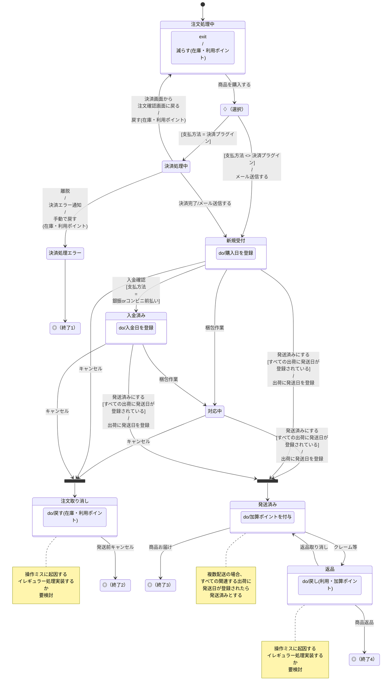

## 受注ステータスの拡張 [#3325](https://github.com/EC-CUBE/ec-cube/pull/3325){:target="_blank"}



[受注対応状況の流れ](/spec_order)も合わせてご確認ください。

### 基本の拡張方法

[Symfony Workflow Component](https://symfony.com/doc/current/components/workflow.html)を利用して実装しています。

ステータス遷移時に行う処理を追加するには、ステータス遷移時のイベントを実装します。
ステータスの遷移は[app/config/eccube/packages/order_state_machine.php](https://github.com/EC-CUBE/ec-cube/blob/4.3/app/config/eccube/packages/order_state_machine.php)に定義しています。

イベントを実装することで受注の遷移時に任意の処理を追加できます。

| 遷移元                     | 遷移先     | イベント                                        |
|------------------------------|------------|-------------------------------------------------|
| 新規受付                   | 入金済み   | `workflow.order.transition.pay`                 |
| 新規受付, 入金済み         | 対応中     | `workflow.order.transition.packing`             |
| 新規受付, 対応中, 入金済み | キャンセル | `workflow.order.transition.cancel`              |
| キャンセル                 | 対応中     | `workflow.order.transition.back_to_in_progress` |
| 新規受付, 対応中, 入金済み | 発送済み   | `workflow.order.transition.ship`                |
| 発送済み                   | 返品       | `workflow.order.transition.return`              |
| 返品                       | 発送済み   | `workflow.order.transition.cancel_return`       |

- 例) 返品時の処理を追加したいとき
    - `workflow.order.transition.return` イベントを受け取る `EventSubscriberInterface` を実装します。

```php
use Symfony\Component\EventDispatcher\EventSubscriberInterface;
use Eccube\Entity\Order;
use Symfony\Component\Workflow\Event\Event;

class SampleTransitionListener implements EventSubscriberInterface
{
    /**
     * 返品時の処理.
     *
     * @param Event $event
     */
    public function onReturn(Event $event): void
    {
        /* @var Order $Order */
        $Order = $event->getSubject();
        .... /* 処理を実装する */
    }

    /**
     * {@inheritdoc}
     */
    public static function getSubscribedEvents(): array
    {
        return ['workflow.order.transition.return' => 'onReturn'];
    }
}
```

### 参考

EC-CUBE のデフォルトのイベントは [src/Eccube/Service/OrderStateMachine.php](https://github.com/EC-CUBE/ec-cube/blob/4.3/src/Eccube/Service/OrderStateMachine.php) に実装されています。

[Using Events](https://symfony.com/doc/current/workflow/usage.html#using-events){:target="_blank"}
